<p align="center">
  <strong>🌐 Language / 语言</strong><br>
  <a href="README.md">中文</a> | <strong>English</strong>
</p>

# OpenClaw Enhanced 🚀

[OpenClaw](https://github.com/openclaw/openclaw) Enhanced — Cross-platform desktop client + full Chinese localization + React frontend rebuild + 3D ranch scene + 30+ UI/performance improvements. Works out of the box, no CLI needed.

## ✨ Features

### 🎮 React Frontend Rebuild (v2026.3.15)

- **All-new React frontend** — Full UI rebuilt with React + Zustand + Framer Motion, component-based architecture
- **18 complete views** — Overview, Chat, Agents, Channels, Config, Models, Sessions, Cron, Usage, and more
- **Responsive layout** — Fully adaptive across phone / tablet / desktop (clamp + breakpoints + flex grid)
- **Apple signed + notarized** — DMG passes Apple Notarization, no Gatekeeper warnings

### 🌾 3D Pixel Ranch Scene (v2026.3.15)

- **Three.js 3D Ranch** — Agents appear as pixel characters on an isometric 3D grassland
- **2D Pixel Ranch** — Alternative Canvas 2D rendering mode
- **Dynamic work zones** — Agents move between zones based on status (processing / waiting / idle)
- **Activity labels** — Real-time display of each agent's current task
- **Gacha-style avatars** — 3:4 portrait-style agent cards

### 🧠 AI Chat Elements (v2026.3.15)

- **🔍 Search Sources** — Web search sources displayed in chat (favicons + collapsible link list)
- **📊 Context Usage** — Real-time token consumption visualization
- **📝 Inline Citations** — In-message citation tags
- **⏳ Queue Status** — Message queue progress visualization
- **📋 Task Steps** — Step-by-step tracking for multi-step tasks
- **🔗 Chain of Thought** — Collapsible AI reasoning panel

### 📱 Full Responsive Layout (v2026.3.15)

- Navigation sidebar auto-collapses to horizontal strip on tablets
- Chat compose area adapts to small screens (no fixed padding, compact buttons)
- Content area auto-centered with max-width
- Ultra-compact mode for mobile ≤400px

### 🌐 Full Chinese Localization

- Complete Chinese UI for the control panel (navigation, config, agents, channels, cron, etc.)
- Chinese labels and help text for 700+ schema config fields
- Search with Chinese character matching

### 📊 Real-time Agent Status Monitoring

- New agent activity status cards on the Overview page (grid card layout)
- Live session processing status (Processing / Waiting / Idle)
- Green pulse animation for active processing, 5s auto-polling refresh

### ⚡ Quick Configuration

- Quick-add model providers (11 presets: SiliconFlow, Kimi Code, Google Gemini, OpenAI GPT, Anthropic Claude, MiniMax, xAI Grok, OpenRouter, Zhipu Coding Plan, Volcengine Coding Plan, Bailian Coding Plan)
- Quick-add messaging channels (Telegram / Lark one-click setup + Agent binding)
- Automatic vision model identification

### 🛠 UI Enhancements

- Standalone "Edit JSON" page (direct nav access, on-demand raw config loading)
- Custom Tooltip component (replaces native browser title tooltips)
- Auto-refresh on Usage page
- Block Streaming support (Lark messages sent in real-time segments)

### 💬 Chat Interface Upgrade

- **Shiki Syntax Highlighting** — Shiki engine (github-dark theme), 40+ languages auto-detected, line numbers + copy button
- **Block-level Markdown Cache** — Major streaming performance boost, only re-renders the last block
- **🧠 Thinking Panel** — Collapsible AI reasoning panel with auto-extracted summary title
- **Tool Call Cards** — Tri-state icons (loading / ✅ done / 🔴 error), collapsible cards
- **Chat Layout Polish** — Borderless bubbles, bold sender names, widescreen optimized
- **Hover Copy Button** — One-click copy on message hover

### 🔗 Channel Pairing Approval

- New **channel pairing request** cards at the top of the Nodes/Devices page
- Support pairing approval for Lark, Telegram, and other channels
- One-click approve, no CLI needed

### 📊 Token Usage Charts

- **Chart.js** — Gradient fill line charts with formatted tooltips (replaces hand-drawn SVGs)
- **1d / 7d / ctx toggle** — Hourly today, daily last 7 days, context composition bar chart
- **Context Composition Analysis** — Horizontal bar chart for System / Tools / Skills / Files token breakdown
- **Agent Dropdown Filter** — Filter data by agent in multi-agent setups

### 📂 Sidebar Session History

- **Session history list** below the Chat accordion group
- Each session shows a friendly name + relative time (e.g. 5m, 2h, 3d)
- Active session highlighted on the left, click to switch
- New session button creates an independent session

### 🛡 Performance Fixes

- Fixed `config.get` RangeError crash with large config files
- Session state tracking is now independent of the diagnostics toggle (always enabled)
- Fixed chat compose area too tall on mobile with misaligned buttons
- Fixed `.chat-main` collapsing to near-zero width on tablet viewports

## 📸 Screenshots

### 🚀 Startup & Setup Wizard

| Splash Screen              | Welcome Wizard             |
| -------------------------- | -------------------------- |
|      |     |

| Select Model Provider          | Configure API Key            |
| ------------------------------- | ---------------------------- |
|  | 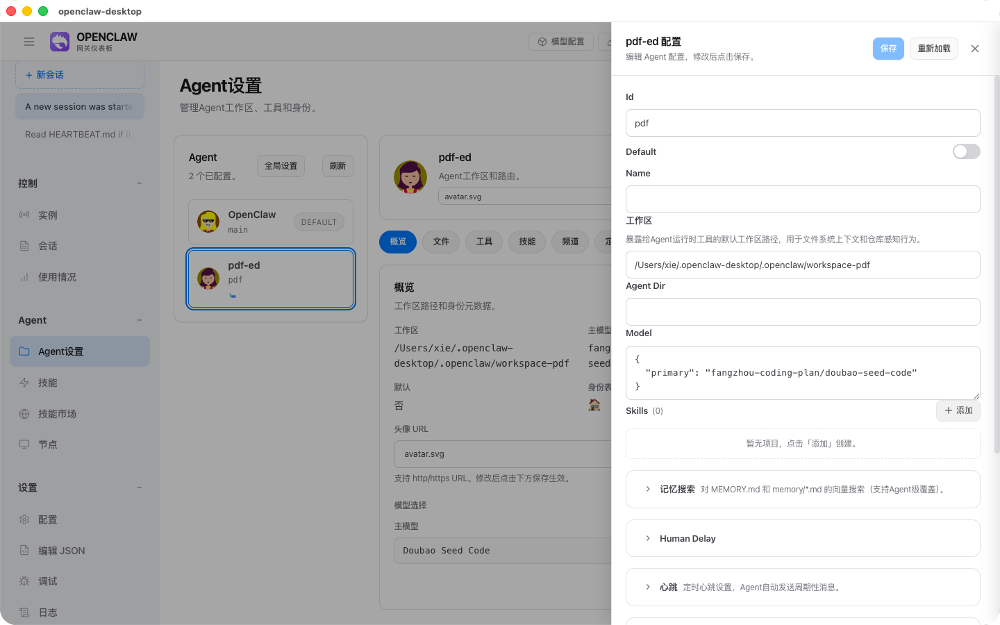     |

| Add Messaging Channel        | Setup Complete             |
| ----------------------------- | -------------------------- |
|   |    |

### 💬 Chat & Main Interface

| Full Chinese UI                          | Overview Page                        |
| ---------------------------------------- | ------------------------------------ |
| 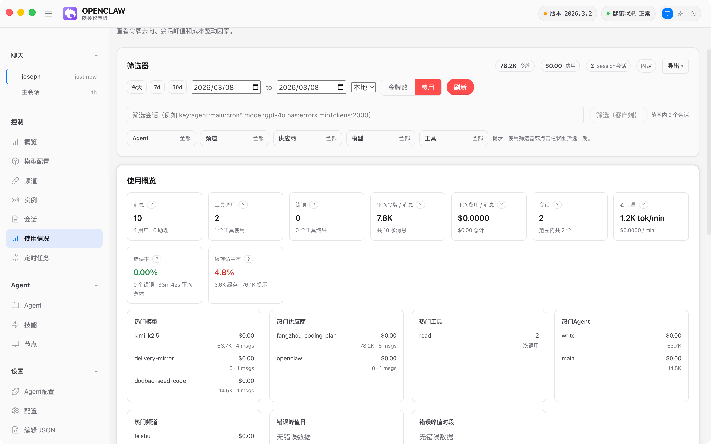         | 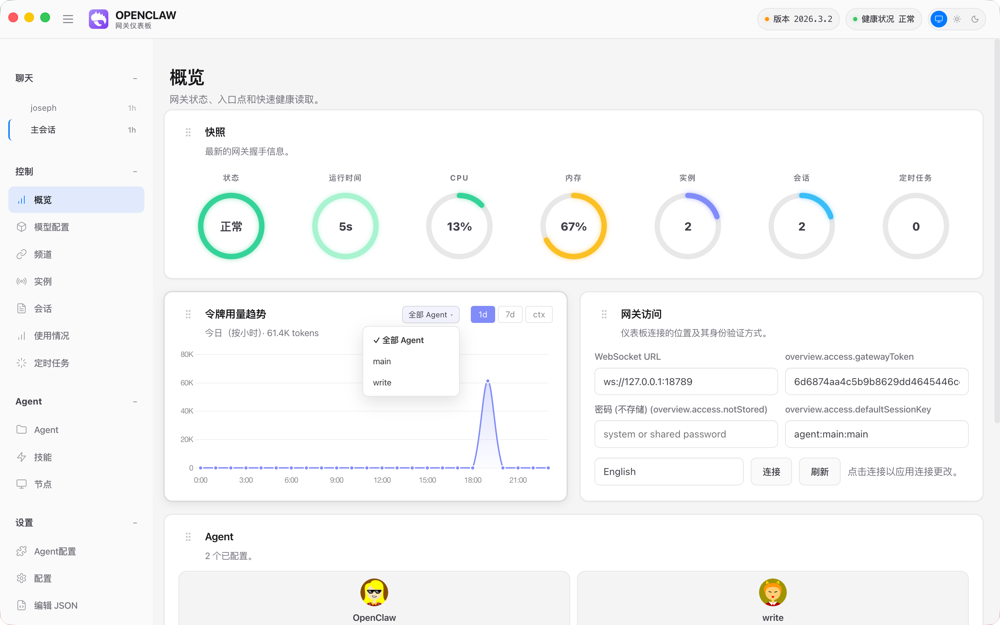        |

| Markdown Code Highlighting                          | Tool Call UI                                   |
| --------------------------------------------------- | ---------------------------------------------- |
| 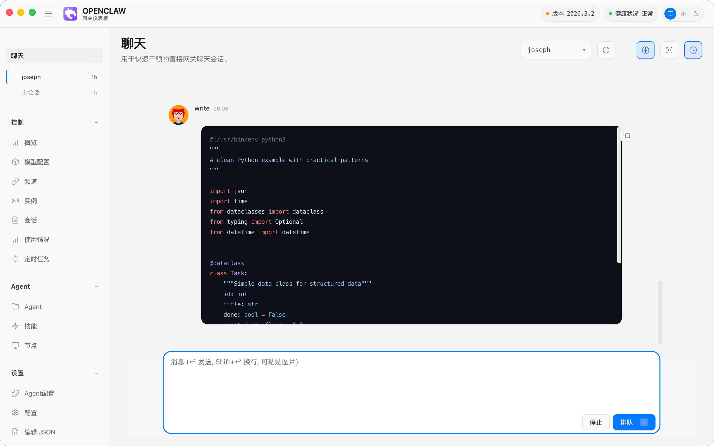 | 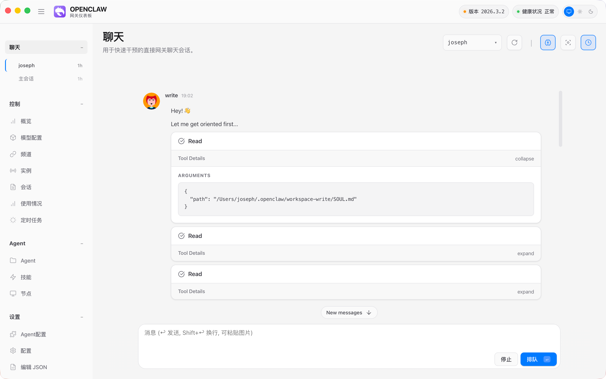        |

### ⚙️ Config Management

| Model Config Page                            | Channel Quick Add                            |
| -------------------------------------------- | -------------------------------------------- |
| 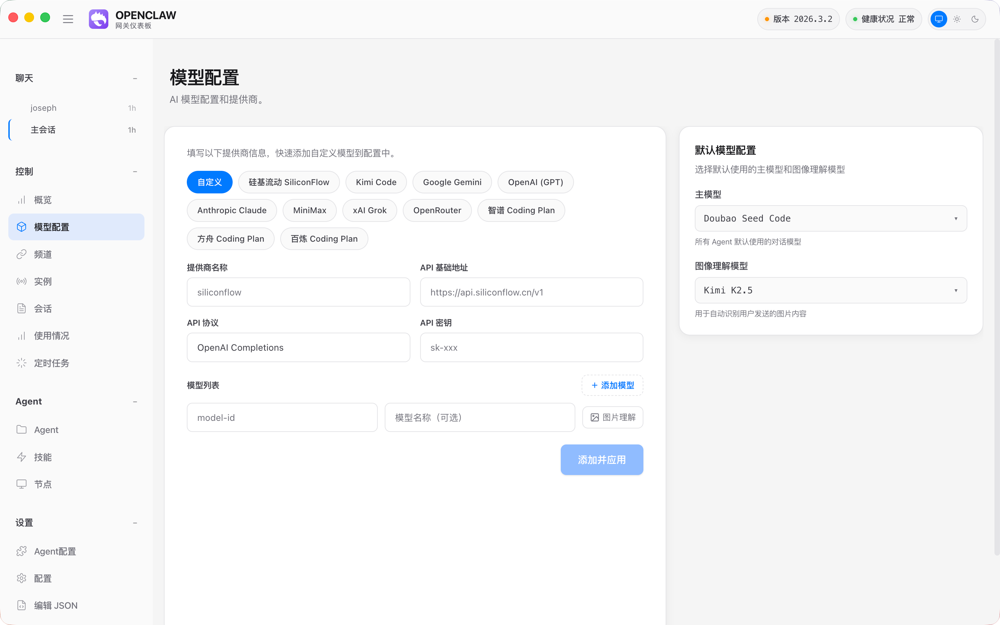        | 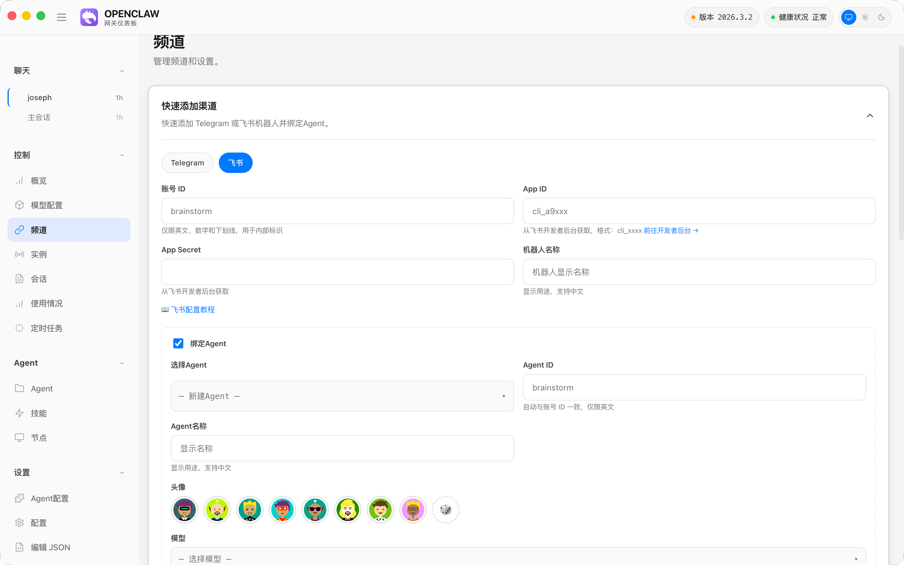      |

| Config File Editor                                 | Channel Visual Approval                            |
| -------------------------------------------------- | -------------------------------------------------- |
| 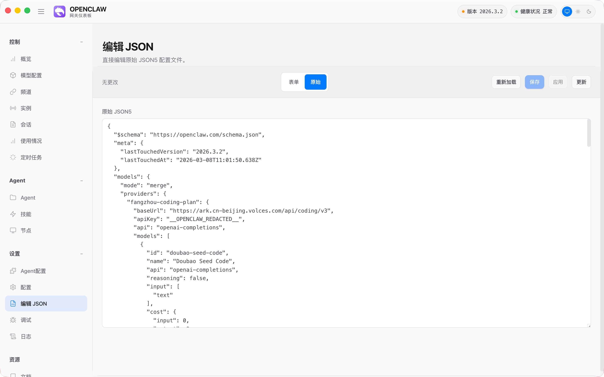         | 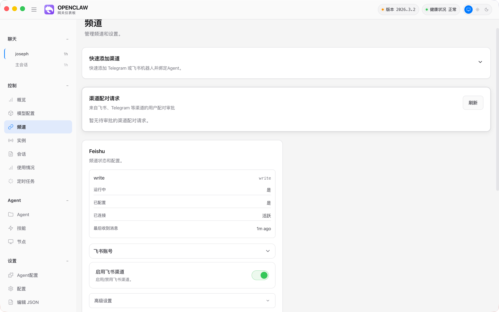        |

### 🎨 More Features

| Dark Theme                               | System Tray                              |
| ---------------------------------------- | ---------------------------------------- |
| 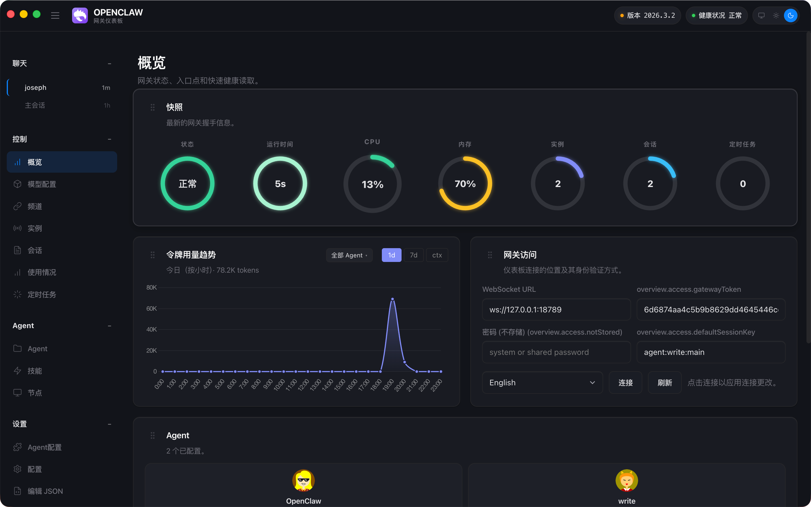      | 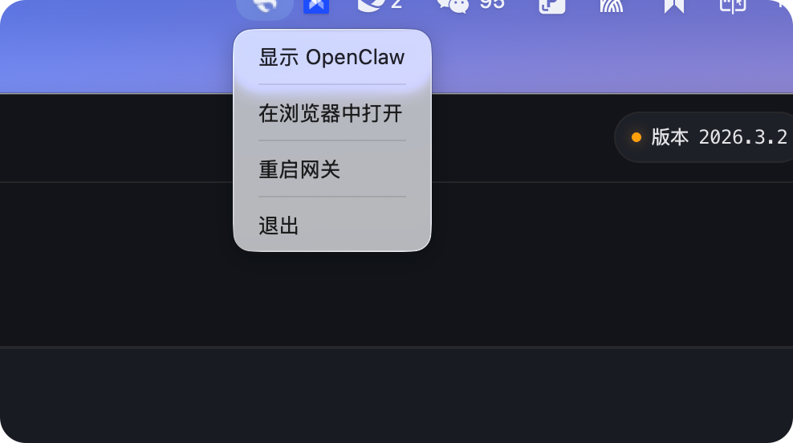              |

### 🆕 v2026.3.15 New Feature Screenshots

| Overview + 2D Ranch Scene                  | Chat (Thinking + Tool Calls)               |
| ------------------------------------------ | ------------------------------------------ |
| 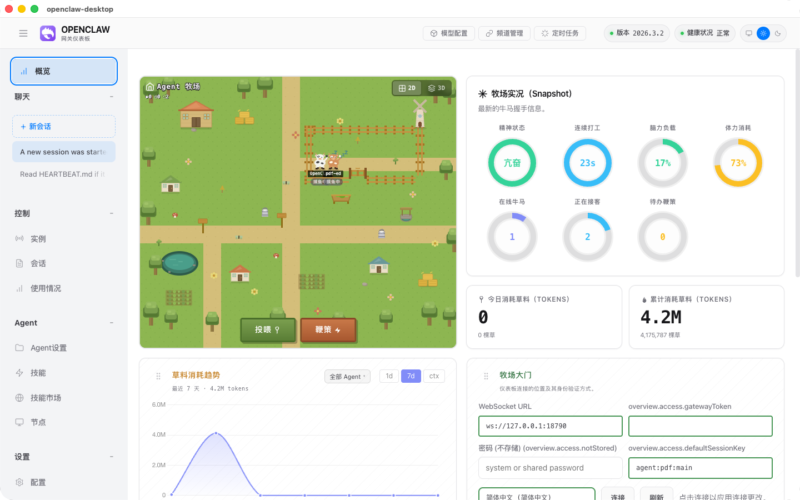| 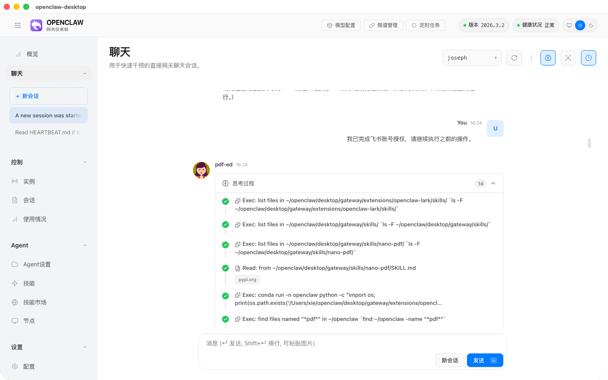   |

| Config Page (Chinese Schema)               | Agent Settings + Sidebar                   |
| ------------------------------------------ | ------------------------------------------ |
| 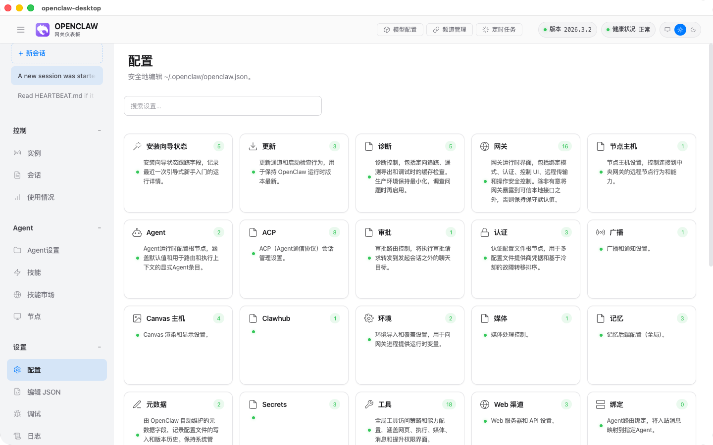   | |

| Channel Management + Quick Add             | Overview Bottom (Charts + Agent Cards)     |
| ------------------------------------------ | ------------------------------------------ |
| 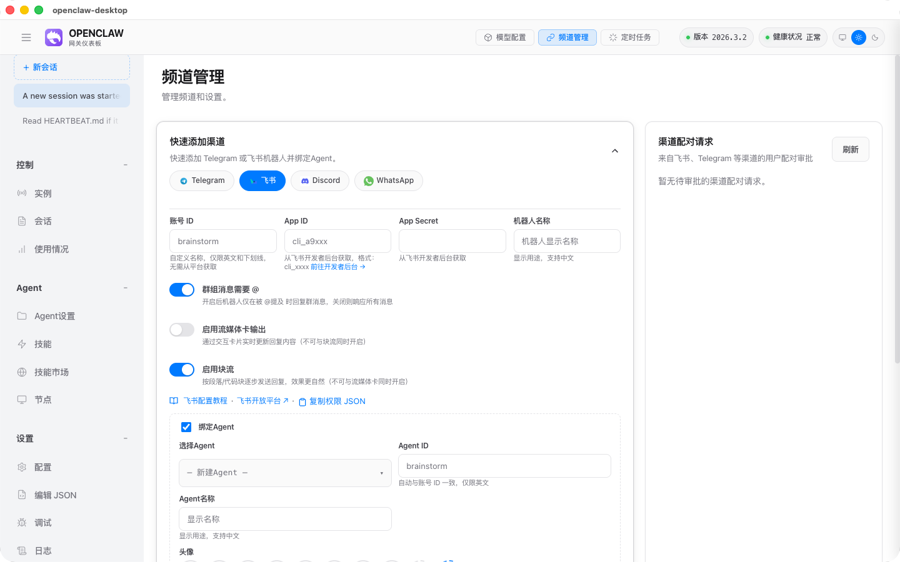| 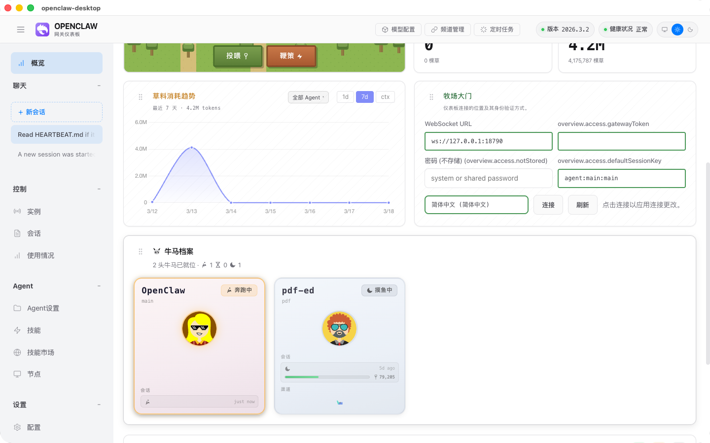 |

## 🖥 Desktop App (Recommended)

Standalone Electron desktop app with a built-in Gateway backend. **No Node.js required — works out of the box.**

### Download

Download the installer for your platform from [Releases](https://github.com/josephxie1/openclaw-UI--Chinese/releases):

| Platform | Download | Notes |
|----------|----------|-------|
| **macOS Apple Silicon** | [OpenClaw-1.0.0-standalone-arm64.dmg](https://github.com/josephxie1/openclaw-UI--Chinese/releases/download/v2026.3.15-zh/OpenClaw-1.0.0-standalone-arm64.dmg) | M1/M2/M3/M4, signed + notarized |

#### macOS First Run

Open the DMG, drag OpenClaw to Applications. v2026.3.15 is signed and Apple-notarized — no extra steps needed.

> If Gatekeeper prompts, run `xattr -cr /Applications/OpenClaw.app`.

### Desktop Features

- 🚀 **Out of the Box** — Built-in Gateway backend, no Node.js or CLI required
- 🧙 **Setup Wizard** — Interactive 3-step onboarding on first launch
- ⚡ **Zero Config Hassle** — No manual `openclaw.json` editing; the wizard generates everything
- 📡 **Quick Model Add** — 11 preset providers
- 🔄 **Auto-restart** — Gateway auto-recovers from crashes
- 🎯 **Native Integration** — macOS tray icon / Windows system tray
- 🛡 **Apple Notarized** — Passes Apple Notarization, no installation warnings

### Build Desktop from Source

```bash
# Interactive build script (macOS)
./scripts/desktop-build.sh

# 0) Launch Desktop Dev directly (no build)
# 1) Build latest Desktop Dev (backend + UI + sync + launch dev)
# 2) Full DMG build (backend + UI + DMG packaging)
```

---

## 📦 CLI Installation

> 💡 **The Desktop app above is recommended.** CLI installation is for server deployments or advanced users.

### Prerequisites

- **Node.js 22** or newer

```bash
node --version  # Should output v22.x.x or higher
```

> If Node.js is not installed, download from [nodejs.org](https://nodejs.org/) or use `nvm install 22`.

---

### macOS / Linux

#### Option 1: One-line Script (Auto-detects & installs Node.js)

```bash
curl -fsSL https://raw.githubusercontent.com/josephxie1/openclaw-UI--Chinese/main/scripts/install-remote.sh | bash
```

#### Option 2: Build from Source

```bash
git clone https://github.com/josephxie1/openclaw-UI--Chinese.git
cd openclaw-UI--Chinese
pnpm install
pnpm build
pnpm pack
npm install -g openclaw-*.tgz
```

---

### Windows

#### Option 1: One-line Script (Auto-detects & installs Node.js)

Open PowerShell **as Administrator** and run:

```powershell
iwr -useb https://raw.githubusercontent.com/josephxie1/openclaw-UI--Chinese/main/scripts/install-remote.ps1 | iex
```

#### Option 2: Build from Source

```powershell
git clone https://github.com/josephxie1/openclaw-UI--Chinese.git
cd openclaw-UI--Chinese
pnpm install
pnpm build
pnpm pack
npm install -g openclaw-2026.3.2.tgz
```

> **Note:** This replaces any existing global `openclaw` installation. To restore the official version, run `npm install -g openclaw`.

## ⚙️ Initial Configuration

After installation, create the config file `~/.openclaw/openclaw.json`:

```bash
openclaw config init
```

Or create a minimal config manually:

```json
{
  "models": {
    "providers": {
      "my-provider": {
        "baseUrl": "https://api.example.com/v1",
        "apiKey": "your-api-key",
        "api": "openai-completions",
        "models": [
          {
            "id": "model-name",
            "name": "My Model",
            "contextWindow": 128000,
            "maxTokens": 8192
          }
        ]
      }
    }
  },
  "agents": {
    "defaults": {
      "model": "my-provider/model-name"
    }
  },
  "gateway": {
    "mode": "local",
    "bind": "loopback"
  }
}
```

After starting the gateway, visit `http://127.0.0.1:18789` to access the control panel.

## 🔄 Update

```bash
npm install -g openclaw-NEW_VERSION.tgz
```

## 🔄 Restore Official Version

```bash
npm install -g openclaw
```

## 📋 Translation Coverage

| Module                            | Status     |
| --------------------------------- | ---------- |
| Navigation & Tabs                 | ✅         |
| Overview (incl. 3D Ranch Scene)  | ✅         |
| Chat Interface (AI Elements)     | ✅         |
| Config Form (Schema Labels)       | ✅ 700+    |
| Config Form (Schema Help Text)    | ✅ 460+    |
| Agent Management                  | ✅         |
| Channel Management                | ✅         |
| Session Management                | ✅         |
| Usage Statistics                  | ✅         |
| Cron Jobs                         | ✅         |
| Skills Management                 | ✅         |
| Node Management                   | ✅         |
| Logs / Debug                      | ✅         |

## 📄 License

- **Original OpenClaw code**: [MIT](LICENSE) — Based on [OpenClaw](https://github.com/openclaw/openclaw)
- **React frontend (`ui-react/`), desktop shell, doc screenshots**: [CC BY-NC 4.0](https://creativecommons.org/licenses/by-nc/4.0/) — © 2026 Joseph Xie, non-commercial use only
